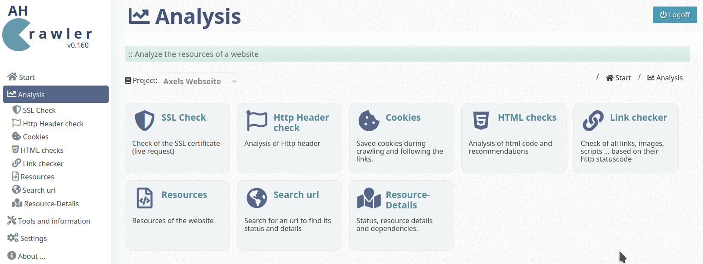

# AH CRAWLER

## Description

AhCrawler is a search engine for your website and analytics tool.

This is free software and Open Source 
GNU General Public License (GNU GPL) version 3

👤 Author: Axel Hahn\
🧾 Source: <https://github.com/axelhahn/ahcrawler/>\
📜 License: GNU GPL 3.0\
📗 Docs: see <https://www.axel-hahn.de/docs/ahcrawler/>

- - - 
It is written in PHP and consists of
- crawler (spider) and indexer
- search for your website
- website analyzer with
  - ssl certificate check
  - saved cookies
  - http response header check
  - linkchecker (http status check of all links, css, images, ...)

It runs on PHP - up to 8.2 (maybe it runs on PHP 7.3 - but this is an already outdated version).
It uses PDO to store indexed data. So far sqlite and mysql were tested.

This is not a version 1.x yet ... let me do some more work :-)

## Screenshot

