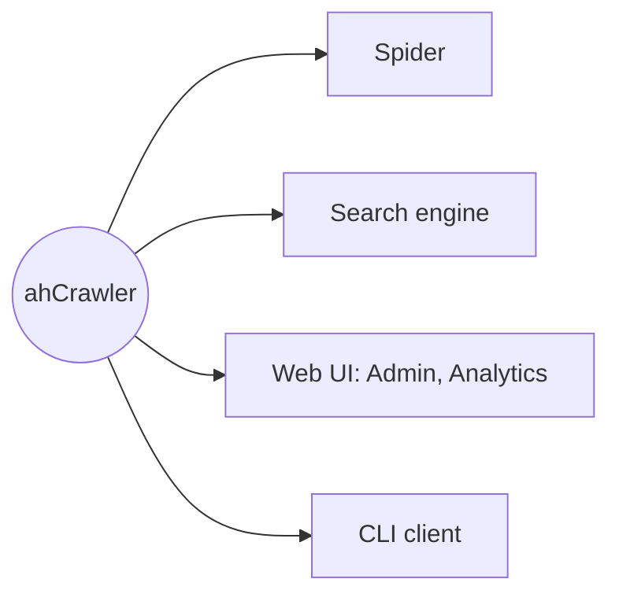

## Overview

The ahCrawler consists of multiple parts.

```mermaid
graph LR
  root((ahCrawler))
  spider[Spider]
  searchForm[Search engine]
  webUI[Web UI: Admin, Analytics]
  cli[CLI client]


  root-->spider
  root-->searchForm
  root-->webUI
  root-->cli

```
