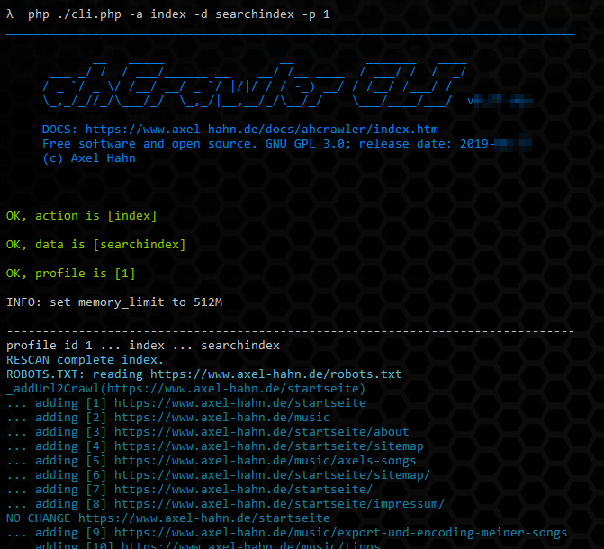

## Crawl a website

Let's go to the command line now. We need to call a cli.php with some parameters.
You can call it without parameter to get a help ... or see page CLI.

**Remark:**

The crawling action can be triggered from the web gui. It has dependencies regarding requet timeout.

Tat's why I recommend the command line or create cron job to atomate indexing tasks.

We start it with action "index" and let crawl profile "1":

```txt
# first go to the application directory
# cd /var/www/ahcrawler/

$ cd bin
$ php ./cli.php --action index --data searchindex --profile 1
```

In the output you can follow the crawling process and how the spider follows detected links in a document ... or not, if a Allow-deny forbids it.
INSERT-lines show that a page content was added in the search index.
At the end of the crawl process you get a summary about the count of pages in the index and used time.

If you reached this point you adjust the profile include and exclude rules that it fits your needs. Then re-run the indexer with cli.php to update your search index.
You also can safely delete the database. The crawling process recreates it. 



## Crawl resources

```txt
# first go to the application directory
# cd /var/www/ahcrawler/

$ cd bin
$ php ./cli.php --action index --data resources --profile 1
```
