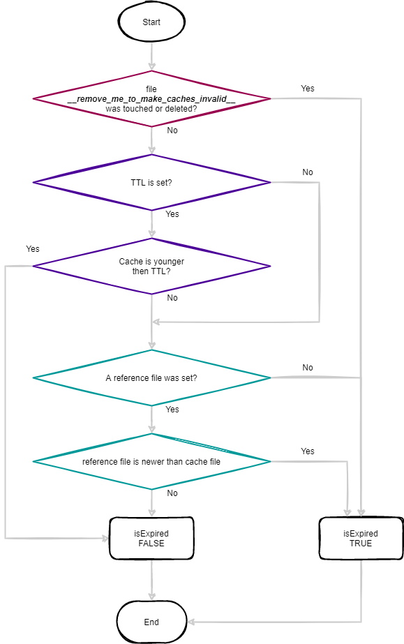

## Code examples

In your application for caching and cleanup you need the file cache.class.php only (which is in the folder src). Copy it into your classes folder.

### Typical usage: TTL

Example using expiration (ttl value):

```php
$sContent='';  
$iTtl=60*5; // 5 min 
  
require_once("/php/cache.class.php");  
$myCache=new AhCache("my-app","task-id");  
  
if($myCache->isExpired()) {  
	// cache does not exist or is expired
	$sContent=...  
  
	// save cache
	$myCache->write($sContent, $iTtl);  
  
} else {  
	// read cached data
	$sContent=$myCache->read();  
}  
  
// output
echo $sContent;  
```

### Typical usage: Reference file

Sometimes the cache depends on a local source file.

As an example: A thumbnail image depends on its original image.

You can set a refernece file in the write method as 3rd param (or by `setRefFile(<file>)`). The method `isExpired()` knows if a ttl or a reference file was set.

Here is a snippet.

```php
$sContent='';  
  
require_once("/php/cache.class.php");  
$myCache=new AhCache("my-app","task-id");  
  
if($myCache->isExpired()) {  
	// cache does not exist or is expired
	$sContent=...  
  
	// save cache
	$myCache->write($sContent, null, $sRefFile);
  
} else {  
	// read cached data
	$sContent=$myCache->read();  
}  
  
// output
echo $sContent;  
```

### Cleanup

Cleanup cache directory 

```php
require_once("/php/cache.class.php");  

// delete all Cachefiles of the module "my-app" older 1 day
$o=new AhCache("my-app");
$o->cleanup(60*60*24*1); 

// or cleanup cachefiles of all modules
$o=new Cache(); $o->cleanup(60*60*24*1);
```

### When is a cache invalid?

Let's have a closer look...

Since version 2.4 a file will be generated on module level:
[cache-dir]/[module]/__remove_me_to_make_caches_invalid__

If you delete this file - i.e. with an SFTP client after connecting to your hoster - then all cached entries for the given module (this feature works per module only) will be invalid.

This file will be recreated on the next cache usage.

This is a fast and strong method to let expire all cache entries. This overrides given TTL values and reference files.



