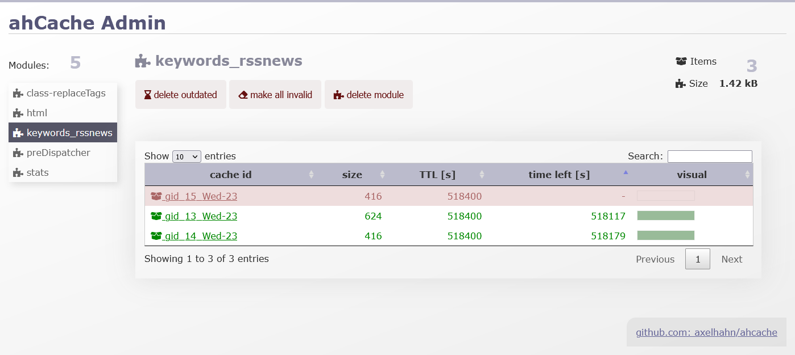

## Cache admin

If you want to enable the cache admin then go to the src drectory and rename the "cache-admin.class-enabled.php.dist" to "cache-admin.class-enabled.php" (without .dist). This file is not used - it must jiust exist.

Then browse to the [url-of-cache-class]/admin/cache-admin.php.

You get a web ui where you can browse and filter the cached items of each module. You easily can see the size an expiration of each item.

Deleting an item, all items of a module is a mouse clik away.

