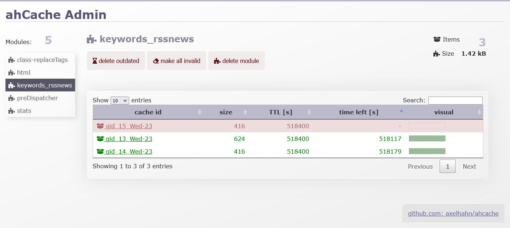

# cache.class.php

AXELS CONTENT CACHE CLASS

File based cache for all serializable types: values, strings, arrays, objects

Version 2.13

👤 Author: Axel Hahn \
🧾 Source: <https://github.com/axelhahn/ahcache/> \
📜 License: GNU GPL 3.0 \
📗 Docs: <https://www.axel-hahn.de/docs/ahcache/>

## Screenshot

Next to the invisible caching class is a web ui to browse all modules and  its known cache items.

